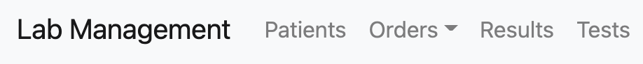

#  
# LabManagement Order System 
​
---

​
1. [Description and User's Story](#description-and-user's-story)
2. [Functionalities](#functionalities)
3. [List of Dependencies and Libraries](#list-of-dependencies-and-libraries) 
4. [Installation](#installation)
5. [Demo](#demo)
6. [Licenses](#licenses)
7. [Support and Contributions](#support-and-contributions)
8. [Future Development](#future-development)
9. [Credits and Acknowledgements](#credits-and-acknowledgements) 
​

​
---
​
## Description and User's Story 
​

​
​
``
AS the owner of a private medical laboratory,
I NEED a managing system,
that ALLOWS me to CREATE orders for medical tests and results for patients, 
as well as CREATE and EDIT patient records, test orders, and lab results.
``
​--

**labManagement** is a Laboratory Information Management System (LIMS), a type software that allows the effective management of samples, lab tests, and associated medical data. 
By using a LIMS, a private commercial laboratory can automate workflows, integrate instruments, and manage sales, and patients' records. 
​

---
​
## Functionalities
​
This React-based LIMS allows users to:
​
* Create new orders by addinng the information of a patient and the type and cost of their laboratory tests.
* After setting the profile of a patient, users can edit orders or look at the different screens to search for tests, results, or specific orders using IDs. 
* A calendar tool allows users to filter orders by date.
* The Existing Orders screen allows users to search already submitted orders and look at their information.​
​
---
​
## List of Dependencies and Libraries
​
The application was designed and programmed using the Router and Router-DOM functions of native *React.js*.

The database and search system is based on the popular *MongoDB* database service anda combination of *JavaScript*, *pure HTML*, *pure CSS*, and *Bootstrap*, a third-party *CSS framework*. The LIMS also uses *Node.js CLI* and additional *NPM* libraries. The application is fully functional and hosted in a *Heroku* external server.
​
The Full-Stack breakdown of the application is as follows:
​
* [Bootstrap 4.6](https://getbootstrap.com/docs/4.6/getting-started/introduction/) and [React Bootstrap Components](https://react-bootstrap.github.io/) the world’s most popular framework for building responsive, mobile-first sites, with jsDelivr and a template starter page.
​
* [NodeJS](https://nodejs.org/en/) is one of the most widely used local server environments for JavaScript programming. NodeJS was used for local server-testing and to handle server and database connections.
​
* [Express](https://www.npmjs.com/package/express) is a NodeJS-based npm web framework library. It was integrated into JavaScript in order to handle HTTP requests from the database schemas. 
​
* [MongoDB](https://www.mongodb.com/) is a general purpose, document-based, distributed database built for modern application developers and for the cloud era.  

---
​
## Installation
​
If you are interested in running **labManagement** locally, you can follow these steps:
​
1. Clone or download the repo.
​
2. Using your terminal, navigate into the main repository and run `npm install` in order to install all npm and NodeJS dependencies and libraries (you may also need to install MySQL or change the database dialect of the schema file).
​
3. Open your preferred code editor, navigate into the configuration folder and add your local server credentials in the development object (username, password, and local host).
​
4. After everything is set, you can then run the application `server.js` using Node in your terminal. After, navigate to your localhost connection on your preferred web browser. Or, alternatively, you can use the demo page we deployed on a [Heroku](https://www.heroku.com/platform) external server. You can access the functional app [here](https://labmanagement1.herokuapp.com/). 
​
---
​
## Demo
​
The following Gif provides a demonstration of this application:
​
![App Demo]
​

​
---
​
## Licenses
​

​

​

​

​

​
---
​
## Support and Contributions
​
This project is not currently looking for contributors.
If you're experiencing any issues with the code, feel free to contact us through GitHub or raise an [issue](https://github.com/rafialmadrid/labManagement/issues) in the original repository. 
​

​
---

## Future Development
​
These are some improved functionalities we want to add to the project in the near future:
​
* Integrate a sidebar in order to edit and add orders in a single page. 
​
* Improve design of fron-end. Right now is minimalist and bare-bones, but there's a lot of room for improvement. 
​
* Succesfully integrate a sales system for orders, rather than just inputting the costs manually.
​
* Currently the landing page and the login system is a mock-up. It requires login in for accesing the system, but there is no user authentication, as well as the possibility of adding and registering users. 
​
* General improvement to user's functionalities and interface: a status showing what user is logged in, and a functionality to edit or add users' information to the profile page.
​
* Integrate an email/calendar system for patients: send email remainders to patients about upcoming tests and discounts. 
​
* Create a separate User system for clients, so they can also access their information, balance account, and existing orders online. 
​
---
​
## Credits and Acknowledgements
​
This project was conceived, developed, and coded by:
​
* **Antonio Ramos Coronado** [Github: AlheliMi](https://github.com/ANTONVAN) (Back-end Developer)
* **Rafael Magaña García** [Github: jpineda30](https://github.com/rafialmadrid) (Front-end Developer)
* **Mario N. Castro Villarreal** [Github: mncastro](https://github.com/mncastro) (Front-end developer)
